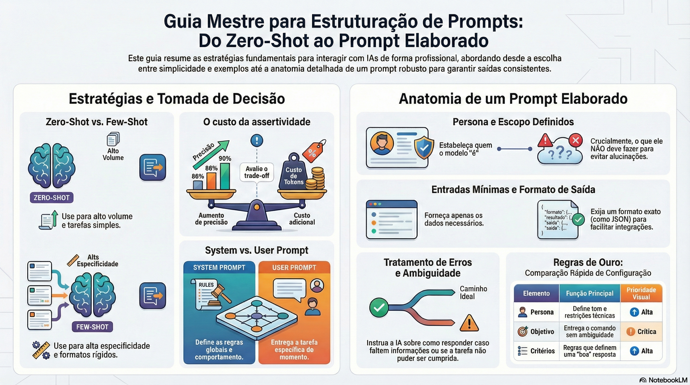

# Estruturação de prompts e estratégias de utilização

**_Nenhuma estratégia para estruturação de prompts resolverá todos os problemas!_**

- Processos e Workflow de desenvolvimento
- Agentes que precisam processar informações para responder um cliente final
- Exploração
- Geração de documentos
- etc

## Casos importantes:
- Quando o problema não será respondido pela IA em larga escala, não economize em tokens.

**Exemplo:**
- Processo de desenvolvimento
- Exploração

- Quando há ou pretende-se escalar uma aplicação, economize ao máximo, porém lembre-se dos trade offs.

**Exemplo:**
- Mais tokens > Custo
- Mais regras ou cadeias de pensamento > Latência

# Guideline:

- Tarefas "simples" / senso comum: (Valide, Identifique, sumarize): Zero Shot
- Alto volume: Zero Shot

- Há muita especificidades ou resultado/formato esperado: Few-shot

**Exemplo:**
- Baseado em X espero Y
- Baseado em Z espero W
- Baseado em A espero ?

Reflexão / Trade offs:

- Zero Shot tenho 86% de assertividade com Custo X
- Few Shot: Tenho 90% de assertividade com Custo X + 20% (por exemplo)

Quanto custa 4% de assertividade?

**Exemplo:**
Custo atual no zero-shot: $10k
Com few-shot: $12k

Ganho com assertividade:
$500 a cada 1%

# System vs User Prompt

## System Prompt
- Regras do jogo
- Define comportamento, tom, restrições do modelo
- Deve ser um manual de instruções permanente para aquela conversa
- Geralmente não muda muito
- Modelo tende a ler como "mais prioritário" do que está no "user"

## User Prompt
- Pergunta / Tarefa
- Pode mudar a cada interação
- Descrição do que o usuário quer naquele momento, já respeitando as regras do system prompt

**Nota mental**
- System = Configuração global da conversa
- User = Pedido específico que você quer que o modelo execute

# Estruturação de prompts elaborados
(normalmente não serão executados em alta escala)

## Persona e Escopo

- Defina quem o modelo "é" e o que NÃO deve fazer.
- - Reduz improvisos e garante alinhamento técnico.

***"Você é um assistente especializado em Node.js vX e testes com Jest. Não faça refatorações no código original."***

## Objetivo

- Descreva de forma direta e sem ambiguidade o que precisa ser feito.

***"Escreva testes para o código abaixo. ❌"***

***"Escreva testes unitários para a função abaixo usando Jest, cobrindo casos de entrada válidos e inválidos ✅"***

## Entradas

Liste somente o necessário para resolver a tarefa.
- Mantenha separação visual
- Evite colar arquivos inteiros se só a parte a é relevante

FUNÇÃO:
```javascript
function calculateDiscount(price, percentage) {
  if (price <= 0 || percentage < 0) return 0;
  return price - (price * percentage / 100);
}
```

## Formato de saída

Defina o formato exato para minimizar riscos de respostas fora de padrão.

Responda apenas com um objeto JSON no formato:
```json
{
  "testFile": "<conteúdo do arquivo de teste>",
  "coverageNotes": "<breve descrição de cobertura>"
}
```

## Critérios de qualidade

Especifique as regras que definem uma boa resposta.

Critérios:
1. O teste deve rodar com `npm test` sem ajustes.
2. Deve cobrir casos de entrada válidos e inválidos.
3. Não usar bibliotecas externas além do Jest.

# Tratamento de ambiguidades e "assumptions"
## Diga o que fazer se faltar informação

***"Se faltar a versão do Node, assuma v18. Liste todos os pressupostos feitos no campo 'assumptions'."***

# Instruções negativas
## Liste o que não pode aparecer na resposta

***"Não inclua explicações ou comentários fora do JSON."***

# Tratamento de erros
## Explique como retornar se não foi possível cumprir.

Se não for possível atender aos critérios, retorne:
```json
{
  "status": "ERROR",
  "reason": "<explicação do problema>"
}
```

# Exemplo completo

**Persona & Escopo:**
Você é um assistente especializado em Node.js v18 e testes com Jest.
Não faça refatorações no código original.

**Objetivo:**
Gerar testes unitários para a função abaixo usando Jest.

**Entrada:**
```javascript
function calculateDiscount(price, percentage) {
  if (price <= 0 || percentage < 0) return 0;
  return price - (price * percentage / 100);
}
```

**Formato de saída:**
Responda apenas com um objeto JSON no formato:
```json
{
  "testFile": "<conteúdo do arquivo de teste>",
  "coverageNotes": "<breve descrição de cobertura>",
  "assumptions": []
}
```

**Critérios:**
1. O teste deve rodar com `npm test` sem ajustes.
2. Cobrir casos de entrada válidos e inválidos.
3. Não usar bibliotecas externas além do Jest.

**Ambiguidade & Pressupostos:**
Se faltar versão do Node, assuma v18 e adicione em "assumptions".

**Instruções Negativas:**
Não inclua explicações ou comentários fora do JSON.

**Tratamento de Erros:**
Se não puder cumprir os critérios, retorne:
```json
{
  "status": "ERROR",
  "reason": "<explicação>"
}
```
# Regras de ouro!

Antes de rodar um prompt, revise se ele:
- Define persona e escopo
- Tem objetivo direto
- Fornece entradas separadas e mínimas
- Define formato de saída
- Lista critérios claros
- Trata ambiguidade e erros
- Inclui proibições necessárias

# Formato dos Prompts

## Structured with specific results (Experts)
- Persona and Scope
- Objective
- Inputs
- Output Format
- Quality Criteria
- Handling Ambiguities and Assumptions
- Negative Instructions
- Error Handling

## Workflow Specification Prompt (Commands)
- Description
- Output template
- Critical Constraints
- Execution Workflow
- Usage Examples
- Negative instructions

## Role Specification (Orchestrator)
- Role Definition
- Core Responsibilities
- Operational Framework
- Decision-Making Principles
- Communication Standards

### [Assista ao resumo em vídeo](https://github.com/user-attachments/assets/f3e51207-44f6-4601-a07c-2eec940a8dde)
