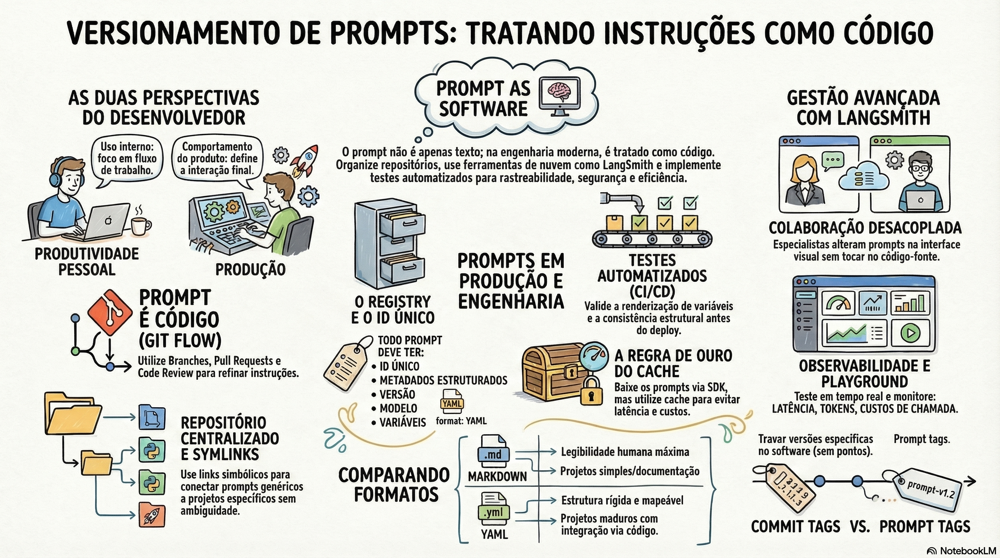

# Versionamento e Gestão de Prompts na Engenharia de Software

## Sumário Executivo
O versionamento de prompts evoluiu de uma prática subestimada para um pilar crítico na engenharia de software moderna. A premissa fundamental é que o prompt deve ser tratado como código, exigindo o mesmo rigor, rastreabilidade e controle de versão (Git) aplicado ao desenvolvimento tradicional. A gestão de prompts divide-se em duas esferas distintas: **Produtividade Pessoal/Equipe**, focada em acelerar o fluxo de trabalho interno, e **Integração em Produção**, onde o prompt constitui a lógica central e probabilística do produto final.

Os principais pilares para uma implementação profissional incluem:

* **Centralização e Organização:** Uso de repositórios centrais com estratégias de links simbólicos para evitar ambiguidade em IAs de editores de código (como Cursor/Copilot).
* **Padronização Técnica:** Preferência pelo formato YAML em ambientes de produção por sua estrutura rígida e facilidade de integração via código.
* **Garantia de Qualidade:** Implementação de testes automatizados para validar a integridade estrutural (variáveis e renderização) e integração em esteiras de CI/CD.
* **Desacoplamento e Colaboração:** Utilização de ferramentas como LangSmith para permitir que profissionais de negócio (PMs, especialistas de domínio) alterem o comportamento da IA sem intervir diretamente no código-fonte, utilizando sistemas de Registry e Cache para performance.

---

## 1. As Duas Perspectivas do Desenvolvedor
A gestão de prompts não é uniforme; ela varia de acordo com o destinatário e o impacto da instrução.

* **Perspectiva 1: Produtividade (Uso Interno):** São ferramentas para o dia a dia (geração de testes, code review, debug). O versionamento aqui visa a organização pessoal e o compartilhamento de "prompts coringas" entre membros da equipe.
* **Perspectiva 2: Integração no Software (Produção):** Prompts que residem dentro do código e operam a inteligência do produto para o usuário final. Alterações aqui são críticas, pois definem o comportamento do sistema e podem causar quebras se não forem rigorosamente controladas.

---

## 2. Estrutura e Arquitetura de Repositórios
A organização física dos prompts determina a eficiência da IA e a facilidade de manutenção.

### 2.1. Repositório Centralizado vs. Específico
Para evitar que prompts fiquem dispersos, recomenda-se um **Repositório Centralizado de Uso Geral**. Contudo, para evitar a ambiguidade massiva (quando a IA do editor lê excesso de regras conflitantes), utiliza-se a estratégia de **Links Simbólicos (Symlinks)**:

1. O desenvolvedor clona o repositório central.
2. No projeto atual, cria-se uma pasta `.prompts/` com links apenas para as instruções relevantes (ex: Python e Testes).
3. Prompts específicos do domínio (regras de negócio únicas) devem ser versionados diretamente no repositório do projeto, não no central.

### 2.2. Formatos de Arquivo e Documentação
A escolha do formato impacta a legibilidade e a integração sistêmica:

| Formato | Vantagem | Contexto de Uso |
| :--- | :--- | :--- |
| **Markdown (.md)** | Alta legibilidade humana. | Documentação e prompts de produtividade simples. |
| **YAML (.yml)** | Estrutura rígida, variáveis declarativas. | Projetos de produção maduros e integração via SDK. |

Cada prompt deve ser acompanhado de um `README.md` contendo:
* O prompt exato.
* Contexto e observações de uso.
* **Changelog:** Histórico de modificações para rastreabilidade.

---

## 3. Gestão de Prompts em Produção
Em produção, o prompt é o "core" da lógica de negócios. O nível de criticidade exige uma infraestrutura de suporte robusta.

### 3.1. O Registry (Catálogo Central)
É obrigatório possuir um Registry — um índice estruturado (em YAML, banco de dados ou serviço em nuvem) que gerencia:
* **ID Único:** Chave primária para o sistema localizar a instrução.
* **Versão (SemVer):** Controle de qual versão está ativa.
* **Metadados:** Modelo de IA alvo (GPT-4, Claude, etc.), variáveis de entrada e saídas esperadas.

### 3.2. Separação de Responsabilidades
Uma regra arquitetural crucial é apartar fisicamente a pasta de prompts do código-fonte. Isso garante que o comportamento (prompt) seja gerenciado de forma independente da lógica *hardcoded* (rotas, controllers), facilitando atualizações sem necessidade de novos deploys da aplicação inteira.

---

## 4. Testabilidade e Automação
Tratar prompt como software implica aplicar testes semelhantes aos de unidade para garantir a consistência estrutural.

* **O que testar:** Validação de mapeamento e renderização, detecção de erros de digitação em nomes de variáveis e identificação de "variáveis órfãs" (declaradas mas não usadas).
* **Asserções (ExpectContents):** Verificação se a resposta renderizada contém termos ou blocos lógicos obrigatórios.
* **CI/CD:** A integração desses testes na esteira de deploy impede que prompts mal estruturados cheguem ao ambiente de produção.

---

## 5. Ecossistema LangSmith e Gestão em Nuvem
Para escalar a gestão e incluir profissionais não-técnicos, soluções como o LangSmith (da família LangChain/LangGraph) são recomendadas.

### 5.1. Colaboração Desacoplada
Ferramentas em nuvem permitem um fluxo visual:
* **Playground:** Teste de instruções em tempo real com métricas instantâneas de latência, tokens e custo financeiro.
* **Iteração:** Product Managers ajustam o tom e o conteúdo sem tocar no Git ou no VS Code.
* **SDK/Pull:** O software baixa o prompt atualizado via API.

### 5.2. O Desafio das Tags e Versões
No LangSmith, deve-se distinguir entre:
* **Prompt Tags:** Metadados visuais para organização.
* **Commit Tags:** Identificadores reais de versão usados no código. *Nota técnica: A plataforma não permite pontos em tags (usa-se v1-0-0 em vez de v1.0.0).* Recomenda-se o uso de tags por ambiente (prod, dev, staging).

### 5.3. Regra de Ouro da Performance: Cache
Baixar prompts da nuvem em cada requisição de usuário é inviável devido à latência e custos de rede. É imperativo implementar um sistema de **Cache** (ex: Redis ou memória local) que armazene o prompt e seja atualizado apenas periodicamente ou via Webhooks.

---

## 6. Conclusão
A maturidade na gestão de prompts exige a compreensão de que a ferramenta (Git, YAML ou LangSmith) é secundária ao conceito de Engenharia de Prompt. O foco deve estar no estabelecimento de IDs únicos, rastreabilidade total, separação entre código e instrução, e na criação de um ambiente onde a inteligência do sistema possa evoluir de forma testável e colaborativa.

### [Assista ao resumo em vídeo](https://github.com/user-attachments/assets/6a2f2e47-56a2-4e39-b2f0-fc43c41dec02)
