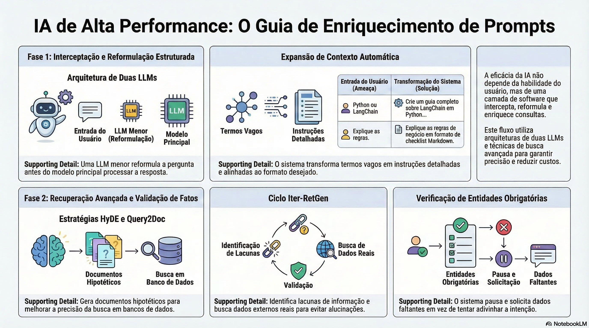

# Otimização de Sistemas de IA: Guia Avançado de Prompt Enrichment e Query Reformulation

## Sumário Executivo
A eficácia de sistemas baseados em Grandes Modelos de Linguagem (LLMs) é frequentemente limitada pela incapacidade dos usuários finais de formularem instruções precisas. A solução estratégica reside na implementação de camadas de software que **interceptam, reformulam e enriquecem** as consultas antes que elas atinjam o modelo principal.

Este documento detalha as arquiteturas de **Prompt Enrichment** e **Query Reformulation**, apresentando técnicas como *Query2Doc*, *HyDE* e *Iter-RetGen* para entregar resultados precisos, reduzir alucinações e otimizar custos.

---

## 1. A Raiz do Problema e a Necessidade de Interceptação
Consultas curtas e sem contexto geram um ciclo ineficiente que prejudica o negócio e a experiência do usuário:

* **Desperdício de Recursos:** Tentativas repetidas consomem tokens desnecessários.
* **Percepção de Ineficiência:** A culpa por uma resposta ruim recai sobre o software.
* **O Paradoxo do Custo:** Investir tokens em enriquecimento é mais barato do que lidar com múltiplos *retries* ou saídas incorretas.

### Cenários de Intervenção
| Cenário | Entrada do Usuário (Ameaça) | Transformação do Sistema (Solução) |
| :--- | :--- | :--- |
| **Vagueza** | "Python ou LangChain" | "Crie um guia completo explicando como trabalhar com LangChain em Python..." |
| **Falta de Contexto** | "Como usar uma API?" | "Explique como utilizar endpoints REST com o framework [X]..." |
| **Alinhamento** | "Explique as regras." | "Explique as regras de negócio em formato de checklist Markdown." |

---

## 2. Arquitetura de Implementação: O Padrão de Duas LLMs
Para viabilizar o enriquecimento sem comprometer a viabilidade financeira, utiliza-se uma arquitetura de interceptação:

1.  **LLM 1 (A Reformuladora):** Modelo menor e econômico (ex: GPT-4o mini, Claude Haiku). Função: reescrever a entrada de forma robusta.
2.  **LLM 2 (A Principal):** Modelo sofisticado (ex: GPT-4o, Claude 3.5 Sonnet). Função: processamento complexo e decisão final.

> **Dica de Performance:** Utilize lógica de *If/Else* ou cache de palavras-chave. Se a consulta contiver termos específicos, injete contextos pré-definidos automaticamente, ignorando a primeira chamada de LLM.

---

## 3. Estratégias Avançadas para Busca e Recuperação (RAG)
Quando a aplicação utiliza dados próprios, perguntas curtas falham em encontrar documentos relevantes.

### 3.1. Query2Doc (Busca Léxica)
Focada em algoritmos como **BM25**. A IA gera um "pseudo-documento" neutro sobre o tema antes da busca. Isso enriquece o vocabulário com sinônimos e termos técnicos, aumentando o "match" com documentos reais.

### 3.2. HyDE - Hypothetical Document Embeddings (Busca Semântica)
Focada em bancos de vetores (**Pinecone, pgVector**). A IA gera uma resposta hipotética assertiva. Este texto serve como "isca": ele possui a carga semântica similar à resposta real, atraindo os vetores corretos do banco de dados.

---

## 4. Iter-RetGen: O Ciclo Iterativo de Geração e Busca
Técnica que força a IA a admitir lacunas de conhecimento, evitando alucinações através do marcador `[MISSING]`.

1.  **Draft (Rascunho):** Geração inicial inserindo `[MISSING]` em dados que precisam de validação.
2.  **Query (Consulta):** Sistema isola os marcadores e formula perguntas de busca específicas.
3.  **Fill (Preenchimento):** Busca informações reais e substitui os marcadores por fatos.
4.  **Expansion (Expansão):** Caso o rascunho seja simples, o sistema força a IA a cavar detalhes profundos.

---

## 5. Query Enrichment e Extração de Entidades
Foca em aperfeiçoar a pergunta antes da execução através da identificação de informações obrigatórias.

* **Identificação de Intenção:** O sistema percebe o objetivo (ex: "Revisar PR").
* **Verificação de Entidades:** Cruza a solicitação com campos obrigatórios (ID do PR, Repositório).
* **Interação Proativa:** Se faltarem dados, o sistema pausa e solicita as informações específicas ao usuário.

---

## 6. Conclusão: A IA como Interceptadora
A engenharia de prompt profissional evoluiu para a criação de **esteiras de raciocínio (Chains)**. O sucesso de uma aplicação robusta depende da interceptação para:

* Validar segurança e toxicidade.
* Corrigir ortografia e expandir vocabulário.
* Injetar metadados de personalização.
* Estruturar saídas para consumo (JSON/Markdown).

### [Assista ao resumo em vídeo](https://github.com/user-attachments/assets/aa443a51-0c5d-4992-9334-0be218f5a5ed)
