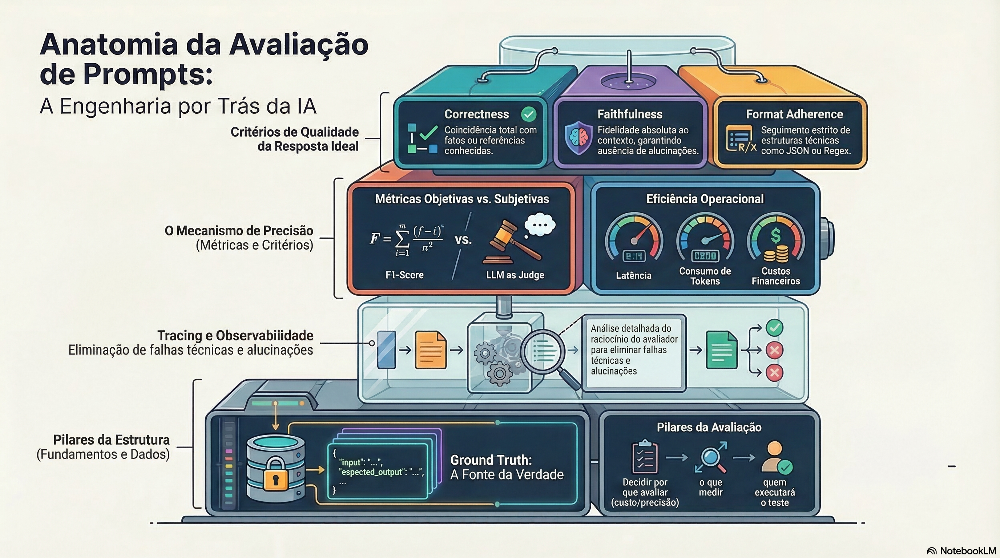

# Guia Abrangente de Avaliação de Prompts: Arquitetura, Métricas e Estratégias

## Sumário Executivo
A avaliação de prompts (**Prompt Evaluation**) é o pilar fundamental para transformar o desenvolvimento de aplicações baseadas em IA em uma disciplina de engenharia rigorosa. A sensibilidade dos modelos a pequenas mudanças exige um processo de avaliação contínuo e fundamentado em dados (**Ground Truth**), garantindo performance otimizada em precisão, fidelidade e eficiência financeira.

---

## 1. Fundamentos da Avaliação de Prompts
A avaliação deve ser tratada como um processo contínuo que responde a três pilares:
1.  **Por que avaliar?** (Redução de custo, precisão técnica, segurança).
2.  **Quais tipos usar?** (Métricas objetivas, subjetivas ou comparativas).
3.  **Quem executará?** (Código, LLM as Judge ou Humano).

---

## 2. Objetivos e Critérios de Avaliação
Categorias padrão para mensurar a qualidade da saída da IA:

| Critério | Descrição |
| :--- | :--- |
| **Correctness** | Coincidência com fatos ou referências conhecidas. |
| **Relevance** | Se a resposta aborda diretamente a pergunta do usuário. |
| **Faithfulness** | Fidelidade ao contexto (ausência de alucinações). |
| **Conciseness** | Objetividade e ausência de informações desnecessárias. |
| **Format Adherence** | Seguimento de formatos específicos (JSON, Regex, Schema). |
| **Efficiency** | Latência, consumo de tokens e custo operacional. |

---

## 3. Métricas e Tipos de Avaliação

### 3.1. Métricas Objetivas (Determinísticas)
Baseadas em fórmulas matemáticas e critérios binários ou estruturais:
* **Exact Match:** Comparação idêntica entre saída e referência.
* **JSON/Schema Validation:** Integridade estrutural da resposta.
* **F1-Score:** Equilíbrio estatístico entre Precisão e Recall.

### 3.2. Métricas Subjetivas e Semânticas
* **LLM as Judge:** Uso de uma LLM superior para avaliar outra baseada em rubricas.
* **Embedding Similarity:** Proximidade semântica via matemática vetorial (Similaridade do Cosseno).

### 3.3. Avaliação Comparativa
* **Pairwise Evaluation:** Comparação direta "lado a lado" entre duas versões de prompts.
* **A/B Testing:** Testes reais em produção para medir a taxa de aceitação.

---

## 4. O Papel dos Avaliadores (Evaluators)
* **Code Evaluator:** Fórmulas que retornam booleanos ou números.
* **Pairwise Evaluator:** Sistema que prefere uma entre duas saídas.
* **Composite Evaluator:** Gera um *score* final baseado em médias ponderadas de múltiplas métricas.

---

## 5. Estrutura de Dados: Datasets e Ground Truth
Para uma avaliação eficaz, é indispensável o uso de um **Dataset**:
* **Ground Truth:** A "fonte da verdade" ou gabarito de respostas.
* **Formato:** Geralmente **JSONL**, contendo pares de `input` (entrada) e `reference` (saída esperada).

---

## 6. Análise de Experimentos e Casos Práticos
* **Temperatura 0:** Essencial para garantir determinismo em validações de formato.
* **Binário vs. Range:** O uso de escalas (0.0 a 1.0) oferece nuances sobre respostas "quase corretas", facilitando o ajuste fino (*fine-tuning*) do prompt.

---

## 7. O Impacto da Engenharia de Prompt: Lições dos "Testes Ruins"
Experimentos com prompts deficientes revelam falhas críticas:
* **O Revisor Otimista:** Ignorar problemas derruba a coerência técnica.
* **O Revisor Verboso:** Aumenta o custo sem agregar valor.
* **O Revisor Alucinado:** Inventar dados aniquila a métrica de *Faithfulness*.

---

## 8. Considerações Finais
O domínio de métricas como **Precision, Recall e F1-Score**, aliado à observabilidade de custos, define um Engenheiro de IA de alta performance. O **tracing** detalhado (análise do raciocínio do avaliador) é a ferramenta definitiva para eliminar a adivinhação.

### [Assista ao resumo em vídeo](https://github.com/user-attachments/assets/79be1927-628c-45b7-8e52-88c3bcfd6e1f)
