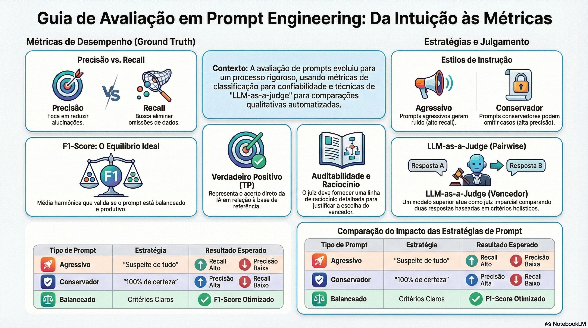

# Avaliação de Prompt Engineering: Métricas Objetivas e Comparação Pairwise

## Sumário Executivo
Este documento sintetiza as metodologias avançadas para a transição de avaliações subjetivas de IA para métricas matemáticas rigorosas. A análise foca na aplicação de **Precisão, Recall e F1-Score** em tarefas de classificação e explora a técnica de **Avaliação Pairwise** (LLM-as-a-judge). A estrutura de um prompt altera drasticamente o desempenho do modelo, exigindo um equilíbrio (*trade-off*) entre sensibilidade e especificidade.

---

## 1. Métricas Objetivas de Classificação
Diferente de avaliações qualitativas, estas métricas medem acertos e erros de forma absoluta contra um **Ground Truth** (base de referência).

### 1.1. Precisão (Precision)
Responde: *"De tudo o que o modelo detectou como positivo, quanto estava realmente correto?"*
* **Foco:** Redução de **Falsos Positivos** (alucinações ou detecções indevidas).
* **Fórmula:** $$\text{Precisão} = \frac{TP}{TP + FP}$$
* **Impacto:** Alta precisão indica confiabilidade, mas pode haver omissão de dados.

### 1.2. Recall (Revocação)
Responde: *"De tudo o que deveria ter sido detectado, quanto o modelo efetivamente encontrou?"*
* **Foco:** Redução de **Falsos Negativos** (omissões).
* **Fórmula:** $$\text{Recall} = \frac{TP}{TP + FN}$$
* **Impacto:** Alto recall indica abrangência, mas pode incluir "ruído" ou erros.

### 1.3. F1-Score
Média harmônica entre precisão e recall. É a métrica de equilíbrio ideal.
* **Fórmula:** $$F1 = 2 \times \frac{\text{Precisão} \times \text{Recall}}{\text{Precisão} + \text{Recall}}$$

---

## 2. Influência do Prompt no Desempenho
O comportamento das métricas é alterado pela "agressividade" das instruções:

| Tipo de Prompt | Estratégia de Instrução | Resultado Esperado |
| :--- | :--- | :--- |
| **Agressivo** | "Suspeite de tudo, reporte qualquer erro." | **Recall Alto** / Precisão Baixa (Gera ruído). |
| **Conservador** | "Traga apenas o que tiver 100% de certeza." | **Precisão Alta** / Recall Baixo (Omite casos). |
| **Balanceado** | "Use critérios claros e categorias específicas." | **F1-Score Otimizado** (Equilíbrio produtivo). |

---

## 3. Metodologia de Cálculo e Implementação
Para calcular estas métricas, comparamos o `output` (IA) com o `expected` (Dataset):

* **Verdadeiro Positivo (TP):** O que a IA acertou.
* **Falso Positivo (FP):** O que a IA inventou ou trouxe a mais.
* **Falso Negativo (FN):** O que a IA deixou passar.

> **Ferramenta Recomendada:** O **LangSmith** atua como um *Summary Evaluator*, consolidando as médias dessas métricas após múltiplas execuções de teste.

---

## 4. Avaliação Pairwise (Comparação Par a Par)
Técnica onde duas respostas (A e B) são comparadas diretamente por um terceiro agente (o juiz).

### 4.1. LLM-as-a-Judge
Um modelo superior (ex: GPT-4o ou Claude 3.5 Sonnet) atua como avaliador imparcial seguindo o fluxo:
1. Execução do Prompt A e Prompt B.
2. Envio de ambos os resultados para o "Juiz".
3. O Juiz decide o vencedor com base em critérios holísticos (clareza, utilidade, precisão).

---

## 5. Auditabilidade e Raciocínio (Reasoning)
A evolução da avaliação exige que o juiz forneça sua **Linha de Raciocínio**:
* **Justificativa Detalhada:** O juiz explica por que A é melhor que B.
* **Transparência:** Permite que desenvolvedores auditem a decisão da IA e refinem os critérios de avaliação.
* **Iteração:** Garante que o prompt continue entregando resultados consistentes mesmo com as atualizações constantes dos modelos base.

---
> "Avaliação é como o teste no desenvolvimento de software: sem ela, não se garante a qualidade ao longo do tempo."

### [Assista ao resumo em vídeo](https://github.com/user-attachments/assets/8bb97934-9c68-4e90-b1ea-d010f5731607)
